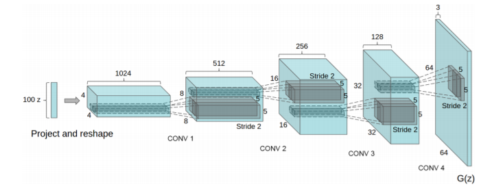
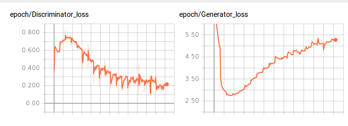

# DCGAN-PyTorch

A PyTorch implementation of [Unsupervised Representation Learning with Deep Convolutional Generative Adversarial Networks](https://arxiv.org/abs/1511.06434)

## Table of Contents:
<!-- Table of contents generated generated by http://tableofcontent.eu -->
- [DCGAN-PyTorch](#dcgan-pytorch)
    - [Project Structure](#project-structure)
    - [Data Preparation](#data-preparation)
    - [Model](#model)
    - [Experiment configs](#experiment-configs)
    - [Usage](#usage)
    - [Results](#results)
    - [Requirements](#requirements)
    - [References](#references)
    - [License](#license)


### Project Structure:
```
├── agents
|  └── dcgan.py # the main training agent for the dcgan
├── graphs
|  └── models
|  |  └── discriminator.py  # discriminator model definition
|  |  └── generator.py  # generator model definition
|  └── losses
|  |  └── loss.py # contains the binary cross entropy 
├── datasets  # contains all dataloaders for the project
|  └── celebA.py # dataloader for celebA dataset
├── data
|  └── celebA  # contains all celebA images
├── utils # utilities folder containing metrics , config parsing, etc
|  └── assets
├── main.py
├── run.sh
```

### Data Preparation:
CelebA dataset has been used. All images are resized to 64x64. Data are placed into ```data/``` folder.

### Model:


This is the model we used in our implementation. However, the number of filters in our implementation goes from 512 -> 256 -> 128 -> 64. This can be tuned in the configurations file be editing the variables: ```num_filt_g``` and ```num_filt_d```.
### Experiment configs:
```
- Input size: 64x64x3
- Batch size: 64
- Learning rate: 0.0002
- Betas for Adam: 0.5 and 0.999
- Number of epochs: 30
- Noise vector size: 100
- Starting number of generator filters: 64
- Starting number of discriminator filters: 64
```
### Usage:
- To run the project, you need to add your configurations into the folder configs/. An example of the configurations that should be passed can be found [here](https://github.com/hagerrady13/DCGAN-Pytorch/blob/master/configs/dcgan_exp_0.json)
- ``` sh run.sh ```
- To run on a GPU, you need to enable cuda in the config file.

### Results:
**Loss**:




**Generated Images after training**:


### Requirements:
- Pytorch: 0.4.0
- torchvision: 0.2.1
- tensorboardX: 1.2

Check [requirements.txt](https://github.com/hagerrady13/DCGAN-PyTorch/blob/master/requirements.txt).

### References:
- Pytorch official example: https://github.com/pytorch/examples/tree/master/dcgan
- DCGAN in torch: https://github.com/soumith/dcgan.torch

### License:
This project is licensed under MIT License - see the LICENSE file for details.
